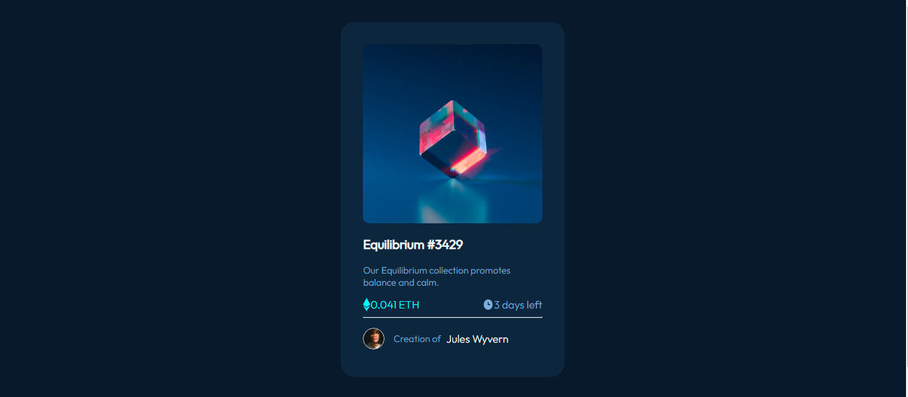
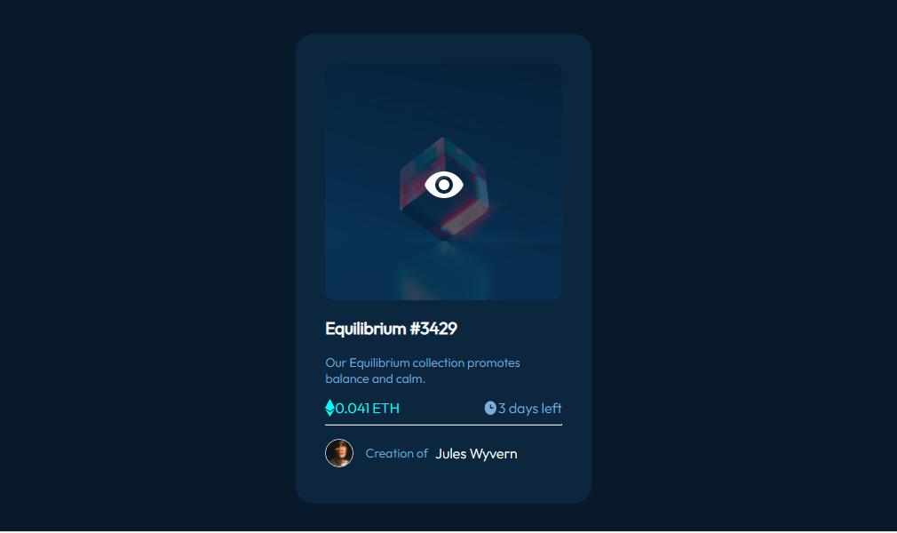
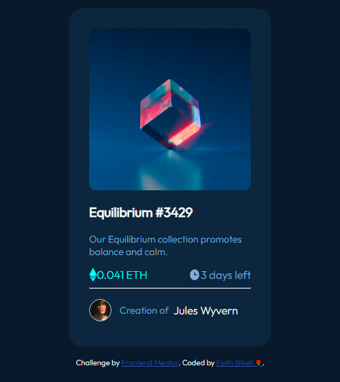

# Frontend Mentor - NFT preview card component solution

This is a solution to the [NFT preview card component challenge on Frontend Mentor](https://www.frontendmentor.io/challenges/nft-preview-card-component-SbdUL_w0U). 

## Table of contents

- [Overview](#overview)
  - [The challenge](#the-challenge)
  - [Screenshot](#screenshot)
  - [Links](#links)
- [My process](#my-process)
  - [Built with](#built-with)
  - [What I learned](#what-i-learned)
  - [Continued development](#continued-development)
- [Author](#author)

## Overview


### The challenge

Users should be able to:

- View the optimal layout depending on their device's screen size
- See hover states for interactive elements

### Screenshots

- Desktop 



- Active 



- Mobile



### Links

- Solution URL: https://github.com/FaithB01/Frontend-mentor/tree/master/Newbies/nft-preview-card-component-main
- Live Site URL: [Add live site URL here](https://your-live-site-url.com)

## My process

### Built with

- Semantic HTML5 markup
- CSS custom properties
- Flexbox
- CSS Grid
- Mobile-first workflow

### What I learned

How to use Media-Query in css

```css
@media screen and (max-width: 600px) {
    body {
        background-color: var(--Very-dark-blueb);
        color: white;
    }
}
```

### Continued development

CSS Cards,Media Query,Image Overlays.

## Author

- Website - [Faith Biketi](https://github.com/FaithB01)
- Frontend Mentor - [Faith Ronana](https://www.frontendmentor.io/profile/FaithB01)


